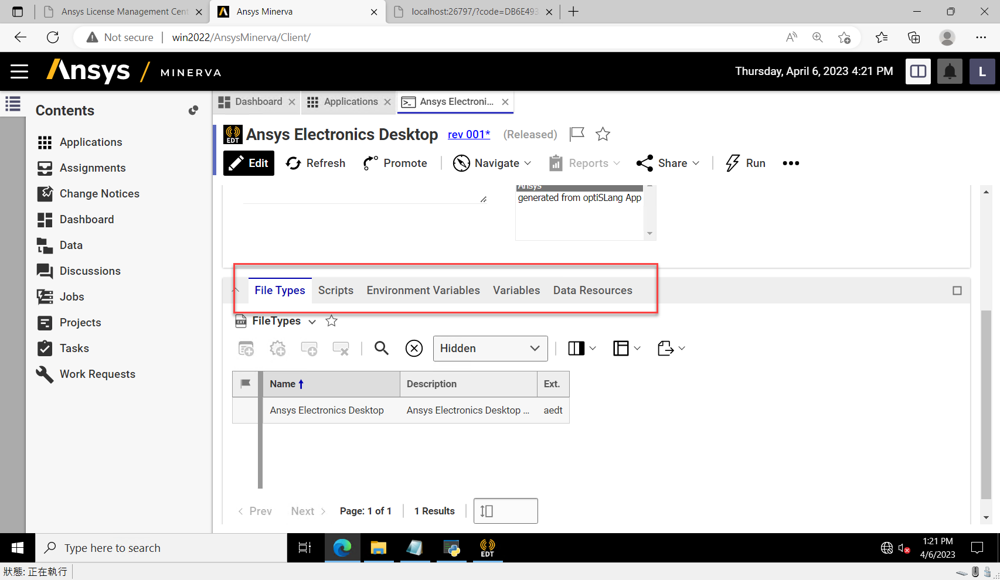

# 更改通知(Change Notice)

在 Ansys Minerva 中，Change Notices 功能用於管理和追踪文檔和模擬項目的更改。更改通知是一種管理工具，用於確保文件的更改是經過授權和審批的。以下是更改通知的主要功能：

1. 提交更改申請：當您需要更改文檔或模擬項目時，可以提交更改申請，並說明更改的原因和目的。
2. 審查更改申請：更改申請將被提交給審查者進行審查。審查者將檢查更改申請的內容，並根據結果進行投票。
3. 批准更改申請：當更改申請得到足夠的審查者投票贊同時，更改申請將被批准。批准後，相應的文件和模擬項目的狀態將被更新，以反映更改。
4. 追踪更改歷史：當更改申請得到批准後，更改歷史將被記錄下來，以便用戶可以查看更改的歷史和相關詳細信息。

總的來說，更改通知是一種管理工具，用於確保文件和模擬項目的更改是經過授權的和經過適當審批的，從而確保項目的一致性和可追溯性。

<figure><figcaption></figcaption></figure>
