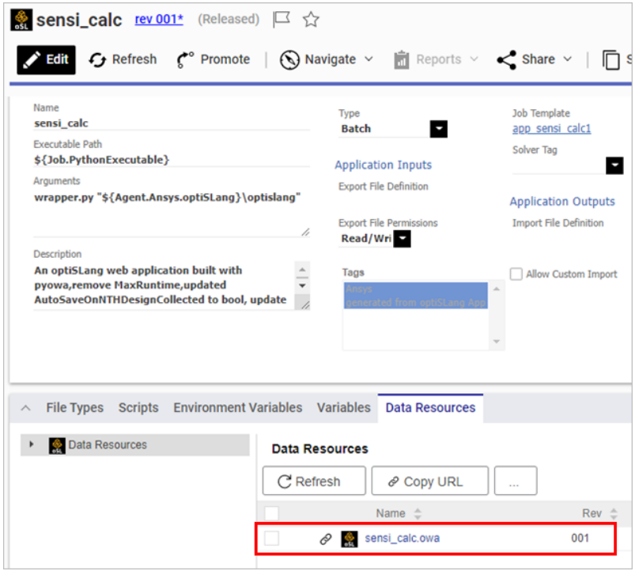

# 自訂Application

### 應用程序定義（Application Definition）

應用程序定義（Application Definition）是一個描述和配置特定應用程序的設定，以便在 Ansys Minerva 平台中使用。這些設定包括應用程序的名稱、可執行文件的路徑、參數、描述、運行類型（本地、批量、HPC VDI 等）、相關的作業範本、文件類型以及其他相關設定。應用程序定義使您能夠根據不同的工作需求和運行環境靈活地配置和使用應用程序。

通過創建應用程序定義，您可以為應用程序提供所需的信息，以便在 Ansys Minerva 平台中正確運行。此外，它還可以幫助管理者確保應用程序在各種運行環境和工作負載下保持靈活性和高度定制性。

<figure><figcaption></figcaption></figure>

### 定義變量

定義應用程式設定包括填寫應用程式名稱、可執行路徑、參數、描述、類型、輸出定義檔、輸出檔案權限、標籤、作業範本、求解器標籤、匯入定義檔、允許自定義匯入和圖示等。其中，類型決定了應用程式在何處以及如何運行，包括本地運行、批次運行、HPC VDI 運行、遠程桌面運行和 optiSLang Web App。如果您想要創建和管理集群、存儲和佇列配置，必須成為系統管理員組或具有相應權限的用戶組成員。

<figure><figcaption></figcaption></figure>

### 選項設定

包括如何在應用程式的「檔案類型」頁籤上指定應用程式要處理的檔案類型，包括點擊添加檔案類型、選擇可用的檔案類型，然後將它們添加到應用程式的「檔案類型」頁籤上。當您將檔案類型與應用程式關聯後，在 Ansys Minerva 中選擇或打開該類型的檔案時，您將在「運行」菜單中看到該應用程式。這使您能夠直接從該檔案啟動該應用程式。

此外，還介紹了如何在「腳本」、「環境變數」和「變量」頁籤上指定腳本、環境變數和變量等相關設置，以及如何在「數據資源」頁籤上上傳含有輸入資料的檔案（例如腳本）。注意，您必須為應用程式關聯至少一種檔案類型，否則您只能在「運行」菜單中查看該應用程式，而不能啟動它。

<figure><figcaption></figcaption></figure>
